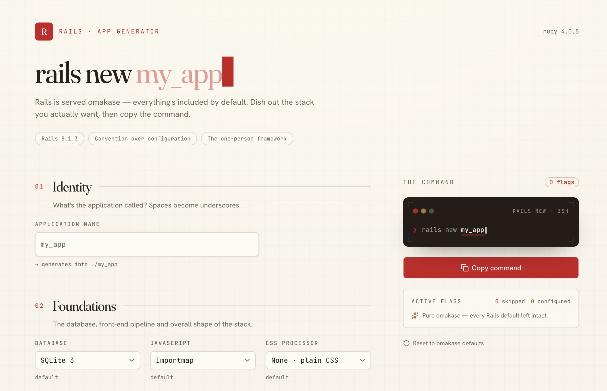

# rails-gen

A small web tool for composing `rails new` commands. Toggle the stack you
actually want, watch the command build live, and copy it into your terminal.

<p align="center">
  
</p>

Rails is served **omakase** — every framework, tool, and integration is included
by default and you opt _out_ with `--skip-*` flags. `rails-gen` turns that big,
easy-to-forget flag list into a form: switches default to "included," flipping
one off adds the matching skip flag, and a handful of opt-in choices (database,
JS bundler, `--api`, `--devcontainer`, …) layer on top. The flag catalogue
mirrors `rails new --help` for **Rails 8.1**.

## Features

- **Live command** — the `rails new …` command (and the page headline) update as
  you type the app name and flip switches.
- **The omakase stack as switches** — Active Record, Active Job/Storage, the
  Action\* frameworks, Hotwire, Jbuilder, the asset pipeline, tests, RuboCop,
  Brakeman, bundler-audit, CI, Bootsnap, Docker, Kamal, Thruster, Solid, git,
  bundle, and more.
- **Foundations** — pick a database driver, JavaScript approach, CSS processor,
  stack posture (`--api` / `--minimal`), and Rails source (`--edge` / `--main`).
- **Clean output** — defaults are omitted, so an untouched form produces just
  `rails new my_app`. The `-d`/`-j` flags (and their selects) disable themselves
  when Active Record / JavaScript are skipped, since Rails ignores them.
- **Copy & tweak** — one-click copy to clipboard, every active flag shown as a
  removable chip, live skipped/configured counts, and a reset to defaults.

## Getting started

You only need [Node](https://nodejs.org) (20.19+ / 22.12+, for Vite 8) and
[pnpm](https://pnpm.io). Rails itself isn't required to run the app — only when
you eventually paste the command it generates.

```sh
pnpm install
pnpm dev          # http://localhost:5173
```

Build and preview a production bundle (built with `@sveltejs/adapter-node`):

```sh
pnpm build
pnpm preview
```

## Scripts

| Script               | What it does                                  |
| -------------------- | --------------------------------------------- |
| `pnpm dev`           | Start the Vite dev server                     |
| `pnpm build`         | Production build                              |
| `pnpm preview`       | Preview the production build                  |
| `pnpm check`         | Sync SvelteKit + type-check with `svelte-check`|
| `pnpm lint`          | Lint with [oxlint](https://oxc.rs)            |
| `pnpm format`        | Format with [oxfmt](https://oxc.rs)           |

## Project structure

```
src/
├─ lib/
│  ├─ rails/
│  │  └─ options.ts            # Flag catalogue + the buildCommand() builder
│  └─ components/
│     ├─ rails/                # Generator UI
│     │  ├─ section-heading.svelte
│     │  ├─ option-row.svelte      # one feature switch
│     │  ├─ segmented.svelte       # posture / source picker
│     │  └─ command-panel.svelte   # terminal slab, copy, flag chips
│     └─ ui/                   # shadcn-svelte primitives
└─ routes/
   ├─ +page.svelte             # Composes the form + holds state
   ├─ +layout.svelte
   └─ layout.css               # Theme, fonts, background, motion
```

## Adding or changing a flag

Everything the form knows about lives in [`src/lib/rails/options.ts`](src/lib/rails/options.ts).
A toggleable feature is one entry in a `FEATURE_GROUPS` cluster:

```ts
{
  id: "active_record",
  label: "Active Record",
  description: "ORM, migrations & queries",
  flag: "--skip-active-record",
  emitWhenOff: true,   // included by default → skip flag emitted when OFF
  defaultOn: true
}
```

- For an **opt-out** feature (the omakase default), set `emitWhenOff: true` and
  `defaultOn: true` — the switch starts on, turning it off emits the flag.
- For an **opt-in** feature (e.g. `--devcontainer`), set `emitWhenOff: false` and
  `defaultOn: false` — the flag is emitted when the switch is on.

Select-style choices (database / JS / CSS / posture / source) are the
`*_OPTIONS` arrays in the same file, wired up in `buildCommand()`. Add a new id
there and handle reverting it in `clearFlag()` in `+page.svelte`.

## Tech stack

- [SvelteKit](https://svelte.dev/docs/kit) + Svelte 5 (runes), TypeScript
- [Tailwind CSS v4](https://tailwindcss.com) + [shadcn-svelte](https://shadcn-svelte.com)
- Type "spec-sheet" aesthetic: Fraunces, Hanken Grotesk, and JetBrains Mono
- Tooling: oxlint + oxfmt, `@sveltejs/adapter-node`

## Notes

- The UI commits to a single light "paper" theme.
- Copy-to-clipboard uses the async Clipboard API, which needs a secure context
  (`localhost` and HTTPS both qualify).
